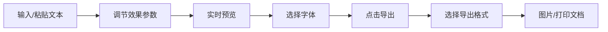

## 1. 产品概述

打字机效果生成器是一款复古风格的在线工具，用户可以输入文字并通过多种参数调节生成带有年代感的打字机效果图片或文档。

- 主要用途：为创作者、设计师、复古爱好者提供快速生成打字机风格文本的工具
- 解决的问题：无需专业设计软件即可生成具有真实打字机缺陷效果的文本
- 目标用户：设计师、作家、社交媒体内容创作者、复古文化爱好者
- 产品价值：提供直观的实时预览和丰富的效果调节，一键导出高质量图片或打印文档

## 2. 核心功能

### 2.1 用户角色
| 角色 | 注册方式 | 核心权限 |
|------|----------|----------|
| 普通用户 | 无需注册 | 使用全部功能，导出图片和文档 |

### 2.2 功能模块
1. **主页面**：文本输入区、效果控制面板、实时预览区域、导出功能区

### 2.3 页面详情
| 页面名称 | 模块名称 | 功能描述 |
|---------|----------|----------|
| 主页面 | 文本输入区 | 支持多行文本输入和粘贴，提供默认示例文本 |
| 主页面 | 错字率控制 | 滑块调节 0-100%，随机替换字符模拟打字错误 |
| 主页面 | 重影强度控制 | 滑块调节 0-100%，文字出现偏移重影效果 |
| 主页面 | 墨点密度控制 | 滑块调节 0-100%，页面添加墨点飞白效果 |
| 主页面 | 错位程度控制 | 滑块调节 0-100%，部分字母上下移动错位 |
| 主页面 | 纸张老旧度控制 | 滑块调节 0-100%，背景泛黄程度调节 |
| 主页面 | 字体选择器 | 提供 4-6 种复古等宽字体选择 |
| 主页面 | 实时预览区域 | 模拟旧档案纸张效果，实时显示参数变化 |
| 主页面 | 导出功能 | 导出为 PNG 图片，或生成打印友好的文档 |

## 3. 核心流程

用户在文本框输入或粘贴文字 → 通过滑块调节各项效果参数 → 实时预览区域即时显示变化效果 → 选择合适的复古字体 → 点击导出按钮 → 选择导出为图片或打印文档 → 下载生成的文件

## 4. 用户界面设计

### 4.1 设计风格
- **主色调**：米白色纸张背景（#f5f0e1），深棕色文字（#3d2b1f），复古红强调色（#8b2500）
- **辅助色**：墨水蓝（#1a365d）、墨绿（#234e3a）
- **按钮样式**：复古机械感，轻微凸起，按下有凹陷效果，圆角 3px
- **字体**：标题使用衬线字体，控制面板使用无衬线字体，预览区使用复古等宽字体
- **布局风格**：左右分栏布局，左侧控制面板，右侧大面积预览区域
- **整体氛围**：档案馆、旧办公室、机械打字机时代的质感
- **图标风格**：线条简约复古，配合噪点纹理

### 4.2 页面设计概述
| 页面名称 | 模块名称 | UI Elements |
|---------|----------|-------------|
| 主页面 | 顶部标题区 | 复古风格标题、副标题说明、微妙的噪点纹理背景 |
| 主页面 | 左侧控制面板 | 卡片式设计，每个滑块带有标签和数值显示，滑块轨道有复古纹理 |
| 主页面 | 文本输入区 | 仿打字机输入框，带有纸张纹理边框 |
| 主页面 | 字体选择器 | 下拉菜单，每个选项显示字体预览 |
| 主页面 | 右侧预览区 | 仿旧档案纸张效果，带有折痕、泛黄、轻微阴影，悬浮微动效 |
| 主页面 | 底部操作区 | 导出按钮组，轻微凸起的复古按钮样式 |

### 4.3 响应性
- 桌面端：左右分栏布局，预览区占 65% 宽度
- 平板端：上下布局，控制面板在上，预览区在下
- 移动端：垂直滚动布局，优化触控操作
- 所有滑块支持触摸操作，按钮最小尺寸 44px

### 4.4 动效设计
- 页面加载：纸张渐入效果，控件依次淡入
- 滑块调节：预览区参数平滑过渡（150ms）
- 按钮交互：悬停轻微上浮，按下凹陷
- 墨点效果：随机生成的淡入动画
- 打字动画：可选项，文字逐字出现的打字机效果
