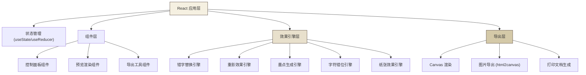

## 1. 架构设计



## 2. 技术描述

- **前端框架**：React@18 + TypeScript
- **构建工具**：Vite@5
- **样式方案**：TailwindCSS@3 + CSS Variables
- **导出库**：html2canvas（用于图片导出）
- **字体方案**：Google Fonts 复古等宽字体（Courier Prime、Special Elite、Typewriter、VT323、Share Tech Mono）
- **第三方服务**：无，纯前端应用

## 3. 目录结构

```
src/
├── components/
│   ├── ControlPanel/          # 控制面板
│   │   ├── Slider.tsx         # 通用滑块组件
│   │   ├── FontSelector.tsx   # 字体选择器
│   │   └── index.tsx          # 控制面板主组件
│   ├── Preview/               # 预览区域
│   │   ├── PaperBackground.tsx # 纸张背景
│   │   ├── TypewriterText.tsx # 打字机文字渲染
│   │   ├── InkSpots.tsx       # 墨点效果
│   │   └── index.tsx          # 预览主组件
│   ├── Export/                # 导出功能
│   │   ├── ExportButtons.tsx  # 导出按钮组
│   │   └── PrintDialog.tsx    # 打印对话框
│   └── Header.tsx             # 页面头部
├── hooks/
│   ├── useTypewriterEffect.ts # 打字机效果核心 hook
│   └── useDebounce.ts         # 防抖 hook
├── utils/
│   ├── charReplacement.ts     # 错字替换逻辑
│   ├── inkGenerator.ts        # 墨点生成算法
│   └── exportUtils.ts         # 导出工具函数
├── types/
│   └── index.ts               # 类型定义
├── constants/
│   ├── fonts.ts               # 字体配置
│   └── defaultSettings.ts     # 默认参数配置
├── App.tsx
├── main.tsx
└── index.css
```

## 4. 类型定义

```typescript
// 效果参数类型
export interface EffectSettings {
  text: string;
  font: string;
  fontSize: number;
  errorRate: number;      // 错字率 0-100
  ghostIntensity: number; // 重影强度 0-100
  inkDensity: number;     // 墨点密度 0-100
  misalignment: number;   // 错位程度 0-100
  paperAge: number;       // 纸张老旧度 0-100
}

// 字体配置类型
export interface FontOption {
  id: string;
  name: string;
  fontFamily: string;
  importUrl: string;
  description: string;
}

// 字符渲染数据
export interface RenderedChar {
  char: string;
  originalChar: string;
  isError: boolean;
  offsetX: number;
  offsetY: number;
  opacity: number;
  ghostOffset: number;
}

// 墨点数据
export interface InkSpot {
  x: number;
  y: number;
  size: number;
  opacity: number;
  type: 'dot' | 'smudge' | 'feather';
}
```

## 5. 核心算法说明

### 5.1 错字替换算法
- 根据错字率计算需要替换的字符数量
- 只替换字母和数字，保留标点和空格
- 使用形近字符映射表（如 o→0, l→1, a→o 等）
- 随机选择替换位置，确保分布均匀

### 5.2 重影效果
- 对每个字符添加 1-2 层半透明副本
- 副本位置根据重影强度随机偏移 1-5px
- 使用 CSS text-shadow 或伪元素实现

### 5.3 墨点生成
- 使用 Poisson Disk Sampling 算法生成分布自然的墨点
- 三种墨点类型：小圆点、污渍、飞白
- 墨点位置避开文字区域（可选）

### 5.4 纸张效果
- 使用多层 CSS 渐变模拟泛黄效果
- SVG 噪点纹理叠加
- 根据老旧度调整：色相偏移、饱和度降低、亮度降低

## 6. 性能优化

- 使用 useMemo 缓存渲染结果
- 使用 useDebounce 限制滑块更新频率（100ms）
- 墨点生成使用 requestAnimationFrame 分批处理
- 预览区域使用 transform 优化渲染性能
